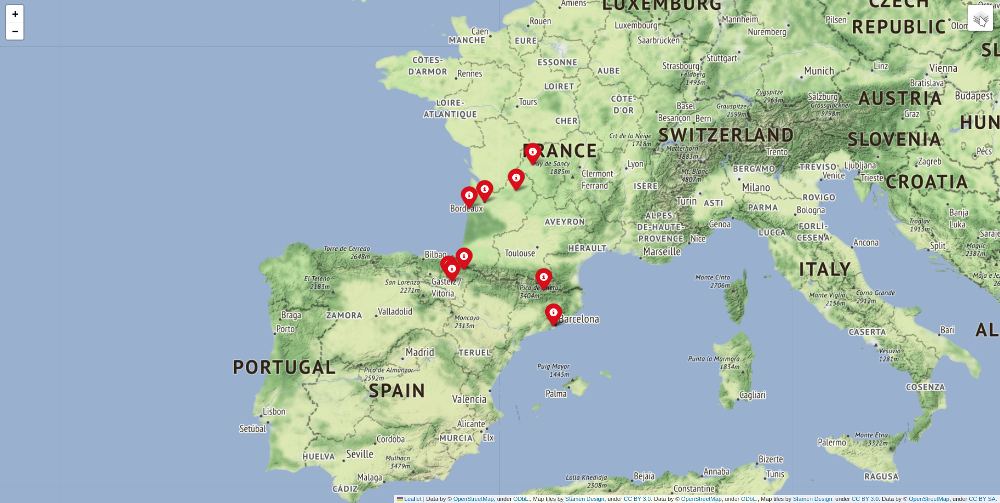

# Film_Map---FP-lab
# 1. Module information
Module contains three functions:
 1. helper_creator
    * creates helper.csv - film data in order name, lattitude, longitude from location.list
 2. map_creator
    * creates html map with 10 nearest film locations for a given year
 3. distance_between_points
    * calculates distance between points by given coordinates in degrees
 
Module is used for creating folium map (.html) with film locations.

To generate a map you need to load main.py with arguments - **year lattitude longitude**
Generated map will contain 10 pop-up markers with the nearest films located near coordinates in a given year. 
helper2.csv contains only **Europe**, so no use for other parts of the world.
# 2. Example
    2006 43.5 0
Map for this input:

We can see pop-up markers on generated map, which contain film name. Also you can change layer in top right corner if you want.

List of layers:
 1. Default
 2. Stamen Tonner
 3. Stamen terrain

So with this map you can try to find films which where filmed in your hometown or in any point Europe you want.
 
